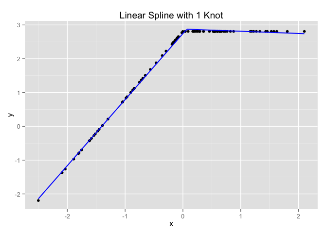

# linearspline

This R package provides functions for fitting a linear regression spline to a set of data and for predicting responses from the spline model to allow for analysis and plotting.

A linear spline is a continuous function formed by connecting linear segments. The points where the segments connect are called the **knots** of the spline. One benefit of linear spline regression is that it can produce a better local fit of the data between the knots.

## Installation

Install the `linearspline` package from GitHub using the `devtools` package.

```r
# If you haven't already done so, install devtools
install.packages("devtools")
devtools::install_github("Creagh/linearspline")
```

## Functions

* `lmspline(x, y, nknots = 1, na.rm = FALSE)` returns the fitted linear spline and chosen knots when `y` is regressed on `x`.

* `pred.spline(x, lspline)` returns predicted values from a `lmspline` object, for data `x`.

*Note:* that `lmspline` places a specified number of knots at evenly spaced quantiles of the given data.

## Usage

A brief example of the `linearspline` package. For more involved examples, please refer to the vignette (below).

First, load the package.

```r
library(linearspline)
```

Next, generate some random values for this toy example.

```r
x <- rnorm(100, 0, 1)
y <- 3 + pmin(2* x, 0) + rnorm(1, 0, 1)
```

Now, fit a linear spline to the data

```r
(lspline <- lmspline(x, y, nknots = 1))
```

```
## $fit
## 
## Call:
## lm(formula = y ~ m)
## 
## Coefficients:
## (Intercept)           m1           m2  
##        2.75         1.95        -2.02  
## 
## 
## $knots
##     50% 
## 0.06593
```

Finally, produce a plot of the data and the fitted linear spline.

```r
library(ggplot2)

# The data must be in a data.frame to use ggplot
df <- data.frame(x,y)
ggplot(df, aes(x, y)) + geom_point() + ggtitle("Linear Spline with 1 Knot") +
	stat_function(fun = pred.spline, args = list(lspline), colour = 'blue', size = 0.7)
```

 

## Vignette

Further details and more examples can be found in the vignette for this package. To view the vignette, run the following command in R and follow the link to the `html` version.

```r
browseVignettes("linearspline")
```

Alternatively, there is a Markdown version of the vignette in the vignettes folder; however, this version does not display the LaTeX equations appropriately, so it is not the preffered method. Instead, please try to first preview the `html` version of the vignette, [here](http://htmlpreview.github.io/?https://raw.githubusercontent.com/Creagh/linearspline/master/inst/doc/overview.html).

**Please do not use the method below to view the vignette, unless the two methods above fail.**

As a last resort, you can find the Markdown version of the vignette, [here](https://github.com/Creagh/linearspline/blob/master/vignettes/overview.md).
